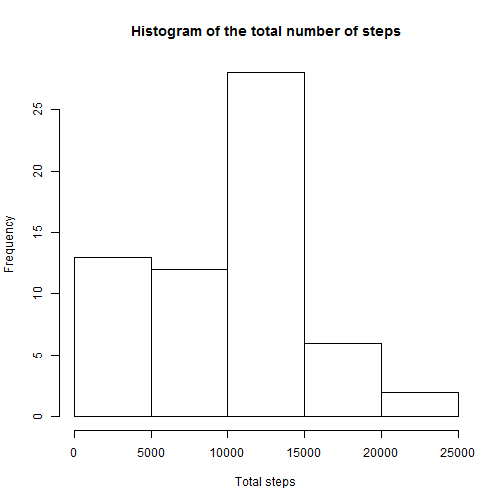
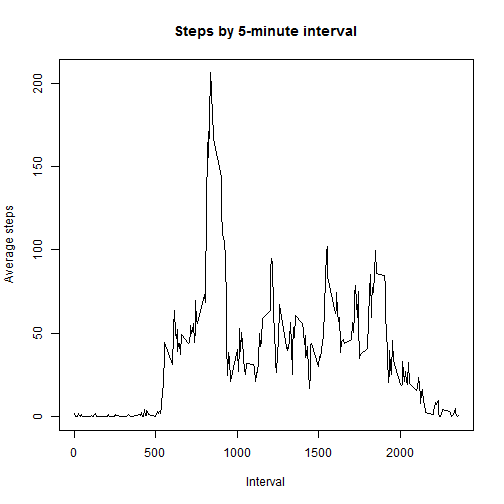
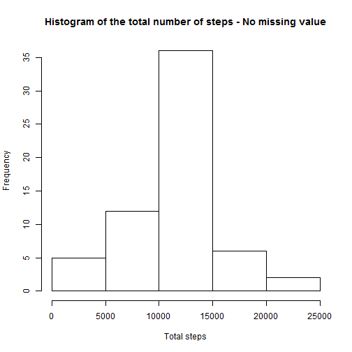
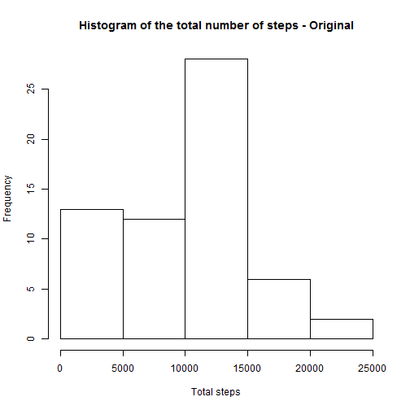
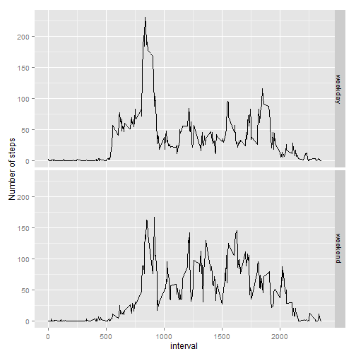

This is an R Markdown document for Peer Assignment 1 in Reproducible Research Course by Coursera. 

#Loading and preprocessing the data


```r
originalPath<-getwd()
if(!file.exists("temp"))
        {dir.create("temp")}        
setwd("temp")
download.file("http://d396qusza40orc.cloudfront.net/repdata%2Fdata%2Factivity.zip", "activity.zip", mode = "wb")
unzip("activity.zip")
data <- read.csv("activity.csv")
```

#What is mean total number of steps taken per day? 

1.Calculate the total number of steps taken per day


```r
totalSteps <- aggregate(data$steps, by = list(date = data$date), FUN = sum, na.rm = TRUE)
names(totalSteps) <- c("date", "steps")
head(totalSteps)
```

```
##         date steps
## 1 2012-10-01     0
## 2 2012-10-02   126
## 3 2012-10-03 11352
## 4 2012-10-04 12116
## 5 2012-10-05 13294
## 6 2012-10-06 15420
```

2. Make a histogram of the total number of steps taken each day


```r
hist(totalSteps$steps, main = "Histogram of the total number of steps", xlab = "Total steps")
```

 

3. Calculate and report the mean and median of the total number of steps taken per day


```r
meanstep <- mean(totalSteps$steps)
medianstep <- median(totalSteps$steps)

meanstep
```

```
## [1] 9354.23
```

```r
medianstep
```

```
## [1] 10395
```

The mean total number of steps taken per day is 9354.2295082.

#What is the average daily activity pattern?

1. Make a time series plot of the 5-minute interval (x-axis) and the average number of steps taken, averaged across all days (y-axis)

```r
average <- aggregate(data$steps, by = list(data$interval), FUN = mean, na.rm=TRUE)
names(average) <- c("interval","average")
plot(average$interval, average$average, type="l", xlab = "Interval", ylab = "Average steps", main = "Steps by 5-minute interval")
```

 

2. Which 5-minute interval, on average across all the days in the dataset, contains the maximum number of steps?

```r
maximum <- average[order(-average$average ),]
maxstep <- maximum[1,1]
maximum[1:3,]
```

```
##     interval  average
## 104      835 206.1698
## 105      840 195.9245
## 107      850 183.3962
```

We can see that the 5-minute interval which contains the maximum number of steps is 835.

#Imputing missing values
1. Calculate and report the total number of missing values in the dataset.

```r
missingvalue <- sum(is.na(data$steps))
missingvalue
```

```
## [1] 2304
```

The number of missing values in the dataset is 2304.

2. Devise a strategy for filling in all of the missing values in the dataset. The strategy does not need to be sophisticated. For example, you could use the mean/median for that day, or the mean for that 5-minute interval, etc.


```r
merging <- merge(data, average, by.x = "interval", by.y = "interval", all = TRUE) 
merging[is.na(merging$steps),2] <- merging[is.na(merging$steps),4]

head(merging)
```

```
##   interval    steps       date  average
## 1        0 1.716981 2012-10-01 1.716981
## 2        0 0.000000 2012-11-23 1.716981
## 3        0 0.000000 2012-10-28 1.716981
## 4        0 0.000000 2012-11-06 1.716981
## 5        0 0.000000 2012-11-24 1.716981
## 6        0 0.000000 2012-11-15 1.716981
```

3. Create a new dataset that is equal to the original dataset but with the missing data filled in.

```r
datafilled <- merging[,1:3]

head(datafilled)
```

```
##   interval    steps       date
## 1        0 1.716981 2012-10-01
## 2        0 0.000000 2012-11-23
## 3        0 0.000000 2012-10-28
## 4        0 0.000000 2012-11-06
## 5        0 0.000000 2012-11-24
## 6        0 0.000000 2012-11-15
```

4. Make a histogram of the total number of steps taken each day and Calculate and report the mean and median total number of steps taken per day. Do these values differ from the estimates from the first part of the assignment? What is the impact of imputing missing data on the estimates of the total daily number of steps?


```r
steptotal <- aggregate(datafilled$steps, by = list(date = datafilled$date), FUN = sum, na.rm = TRUE)
names(steptotal) <- c("date", "steps")
hist(steptotal$steps, main = "Histogram of the total number of steps - No missing value", xlab = "Total steps")
```

 

```r
hist(totalSteps$steps, main = "Histogram of the total number of steps - Original", xlab = "Total steps")
```

 

```r
meansteptotal <- mean(steptotal$steps)
mediansteptotal <- median(steptotal$steps)

meanstep
```

```
## [1] 9354.23
```

```r
meansteptotal
```

```
## [1] 10766.19
```

```r
medianstep
```

```
## [1] 10395
```

```r
mediansteptotal
```

```
## [1] 10766.19
```

The original mean is 9354.2295082, mean with no missing value is 1.0766189 &times; 10<sup>4</sup>.

The original median is 10395, median with no missing value is 1.0766189 &times; 10<sup>4</sup>.

Yes, they do. We can observe that the frequency was changed in the steps between 10000 and 15000. As well as, in the steps between 0 and 5000.

#Are there differences in activity patterns between weekdays and weekends?

1. Create a new factor variable in the dataset with two levels - "weekday" and "weekend" indicating whether a given date is a weekday or weekend day.

```r
datafilled$dayofweek <- ifelse(as.POSIXlt.factor(datafilled$date,format = "%Y-%m-%d")$wday %in% 1:5, "weekday", "weekend")

head(datafilled)
```

```
##   interval    steps       date dayofweek
## 1        0 1.716981 2012-10-01   weekday
## 2        0 0.000000 2012-11-23   weekday
## 3        0 0.000000 2012-10-28   weekend
## 4        0 0.000000 2012-11-06   weekday
## 5        0 0.000000 2012-11-24   weekend
## 6        0 0.000000 2012-11-15   weekday
```

2. Make a panel plot containing a time series plot (i.e. type = "l") of the 5-minute interval (x-axis) and the average number of steps taken, averaged across all weekday days or weekend days (y-axis). See the README file in the GitHub repository to see an example of what this plot should look like using simulated data.


```r
averageweekday <- aggregate(datafilled$steps, by = list(datafilled$interval, datafilled$dayofweek), FUN = mean, na.rm=TRUE)
names(averageweekday) <- c("interval","dayofweek","average")
require(ggplot2)
```

```
## Loading required package: ggplot2
```

```r
ggplot(averageweekday, aes(interval)) + geom_line(aes(y=average)) + facet_grid(dayofweek ~ .) + ylab("Number of steps")
```

 

```r
setwd(originalPath)
```

We can see that there are differences in activity patterns between weekdays and weekends.
